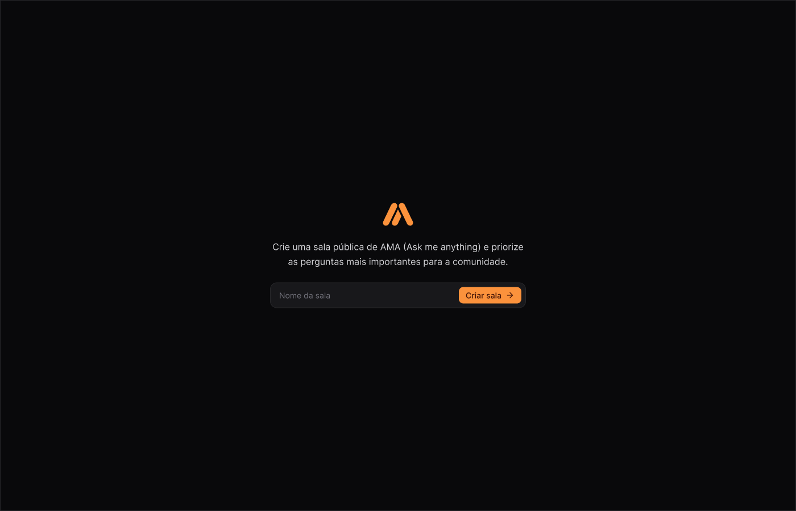

  

# AMA (Ask me anything)

This is a project aimed at creating an interactive platform where you can ask any question and get answers directly from our community! Any user can ask a question on any topic, and others can vote on the questions they find most interesting or relevant. The questions with the most votes are prioritized and answered first, ensuring that the most important issues for the community are addressed. Our goal is to create a space where knowledge is shared openly and accessibly, encouraging curiosity, promoting continuous learning, and strengthening the community through collaboration and mutual respect.

## Tech Stack

<!--- # "Verify icons availability here https://github.com/tandpfun/skill-icons" -->

## Getting Started

1. **Install Dependencies**: `npm install or yarn`
2. **Start Developing**: `npm run dev`

## Contribute

1. **Clone project**: `git clone https://github.com/oswaldo-oliveira/ask-me-anything-front-end.git`
2. **Create feature/branch**: `git checkout -b feature/NAME`
